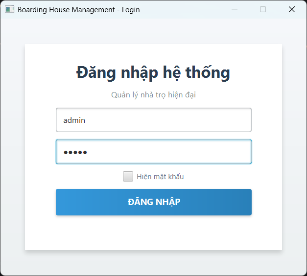
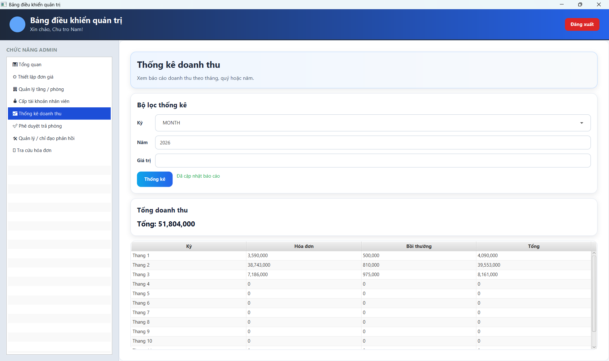
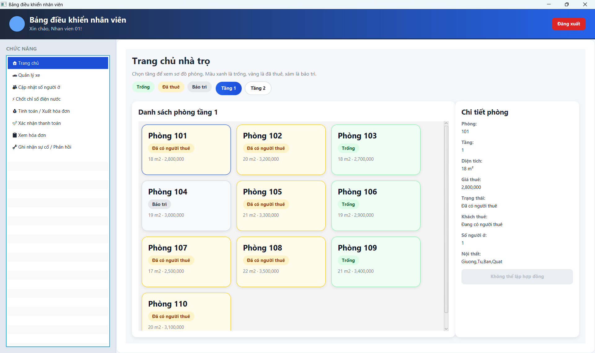

# Boarding House Management System

## 1. Tổng quan dự án
Boarding House Management System là ứng dụng desktop được xây dựng bằng JavaFX, kiến trúc MVC, Hibernate/JPA và MySQL.
Hệ thống hỗ trợ quản lý phòng, quản lý khách thuê, vòng đời hợp đồng, ghi chỉ số điện nước, lập hóa đơn, xử lý bồi thường, xử lý phản hồi, xác thực đăng nhập, dashboard và thống kê.

## 2. Công nghệ sử dụng
- Java 21
- JavaFX
- Maven
- Hibernate ORM / JPA
- MySQL 8
- IntelliJ IDEA

## 3. Chức năng chính
- Đăng nhập theo phân quyền (ADMIN / NHAN_VIEN)
- Quản lý tài khoản và nhân viên
- Quản lý phòng
- Quản lý khách thuê
- Tạo hợp đồng và xử lý quy trình trả phòng
- Quản lý chỉ số điện, nước
- Tạo hóa đơn và theo dõi thanh toán
- Quản lý bồi thường
- Quản lý và xử lý phản hồi
- Dashboard và màn hình tổng quan
- Tích hợp MySQL với Hibernate/JPA

## 4. Kiến trúc
Dự án áp dụng kiến trúc MVC + Service + Repository.
- View: màn hình và panel JavaFX
- Controller: điều phối giữa giao diện và tầng service
- Service: xử lý nghiệp vụ và kiểm tra dữ liệu
- Repository: truy cập dữ liệu bằng JPA
- Entity: mô hình miền lưu trữ bền vững

## 5. Cấu trúc dự án
- src/main/java: mã nguồn ứng dụng
- src/main/resources: tệp cấu hình
- 01_create_database.sql: script tạo cơ sở dữ liệu
- 02_create_tables.sql: script tạo bảng
- 03_insert_sample_data.sql: script dữ liệu mẫu
- src/main/java/com/example/house/uml: sơ đồ PlantUML
- target: thư mục build output

## 6. Thiết lập cơ sở dữ liệu
### Bước 1: Tạo và nạp dữ liệu mẫu
Chạy theo thứ tự:
1. 01_create_database.sql
2. 02_create_tables.sql
3. 03_insert_sample_data.sql

### Bước 2: Cập nhật cấu hình kết nối
Mở src/main/resources/META-INF/persistence.xml và cập nhật:
- Tên đăng nhập database
- Mật khẩu database
- JDBC URL (nếu cần)

Ví dụ JDBC URL hiện tại:
jdbc:mysql://localhost:3306/BoardingHouse_Pro?useSSL=false&serverTimezone=Asia/Ho_Chi_Minh&allowPublicKeyRetrieval=true

## 7. Cách chạy dự án
1. Mở dự án bằng IntelliJ IDEA
2. Chờ Maven tải xong dependencies
3. Đảm bảo MySQL đang chạy và đã chạy đủ các script SQL
4. Chạy lệnh Maven: mvn clean javafx:run
   hoặc chạy class com.example.house.Main trực tiếp từ IDE

## 8. Tài khoản mẫu
Admin
- Username: admin
- Password: 12345

Staff
- Username: staff
- Password: 12345

## 9. Sơ đồ UML
Các sơ đồ UML được lưu tại src/main/java/com/example/house/uml:
- Use Case Diagram
- Activity Diagram
- Sequence Diagram
- Class Diagram

## 10. Ảnh màn hình

### Login Screen

### Dashboard

### Room Management

## 11. Thành viên nhóm
- Nguyễn Đăng Khoa   - 23110242
- Nguyễn Đình Quang Minh - 23110264

## 12. Phân quyền chức năng
ADMIN
- Xem dashboard
- Quản lý nhân viên và tài khoản
- Quản lý phòng và cấu hình giá
- Duyệt yêu cầu trả phòng
- Xem báo cáo và thống kê

NHAN_VIEN
- Quản lý khách thuê và hợp đồng
- Ghi chỉ số điện nước và quản lý hóa đơn
- Xử lý bồi thường và phản hồi

## 13. Hướng phát triển
- Mã hóa mật khẩu bằng BCrypt
- Xuất báo cáo ra Excel/PDF
- Tìm kiếm và lọc nâng cao
- Hệ thống thông báo và nhắc việc
- Nhật ký thao tác (audit log)
- Phân quyền chi tiết hơn

## 14. Kết luận
Dự án thể hiện cách xây dựng một hệ thống quản lý desktop thực tế bằng JavaFX, MVC, Hibernate/JPA và MySQL theo hướng kiến trúc rõ ràng, dễ mở rộng.

## Phụ lục: Mẫu Git Ignore cho IntelliJ Maven
Các mục nên ignore:
- target/
- .idea/
- *.iml
- out/
- logs/
- .DS_Store
